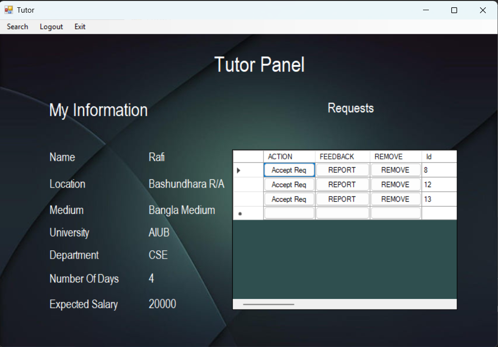
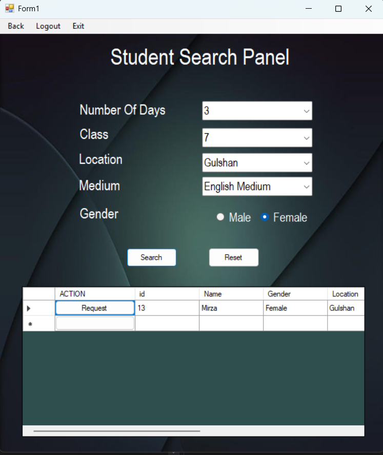
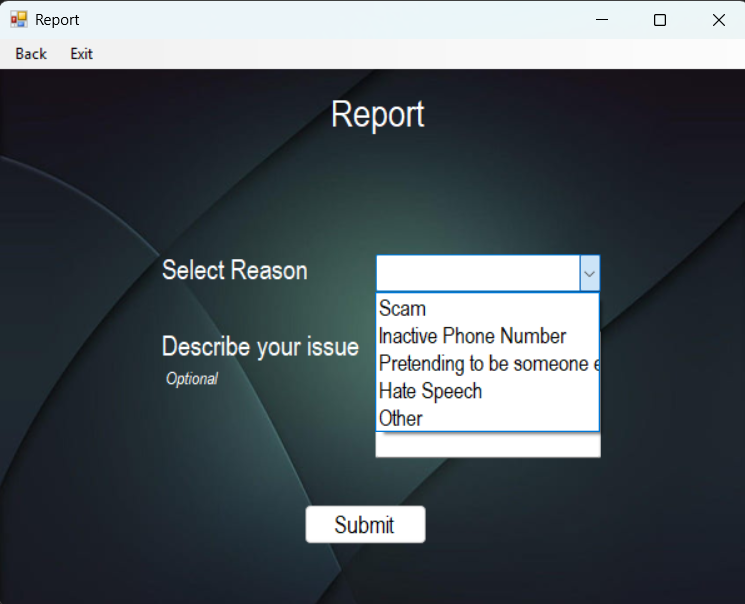
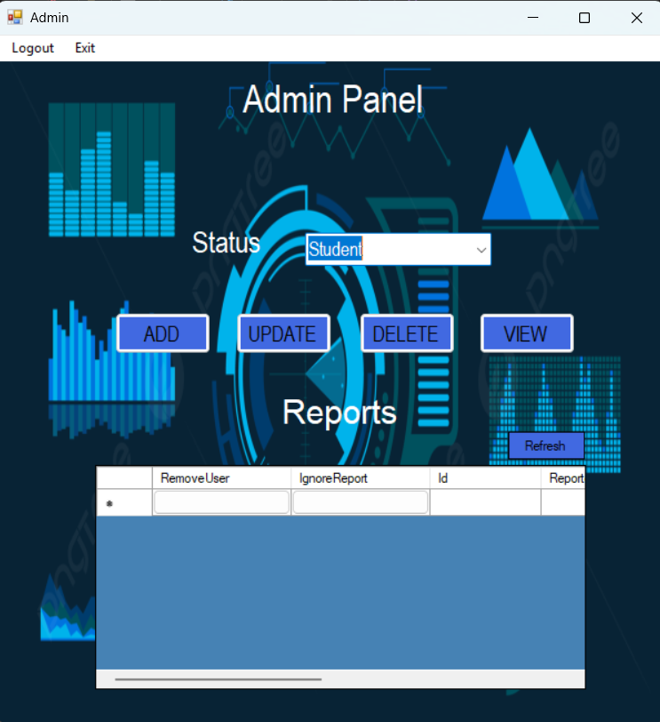
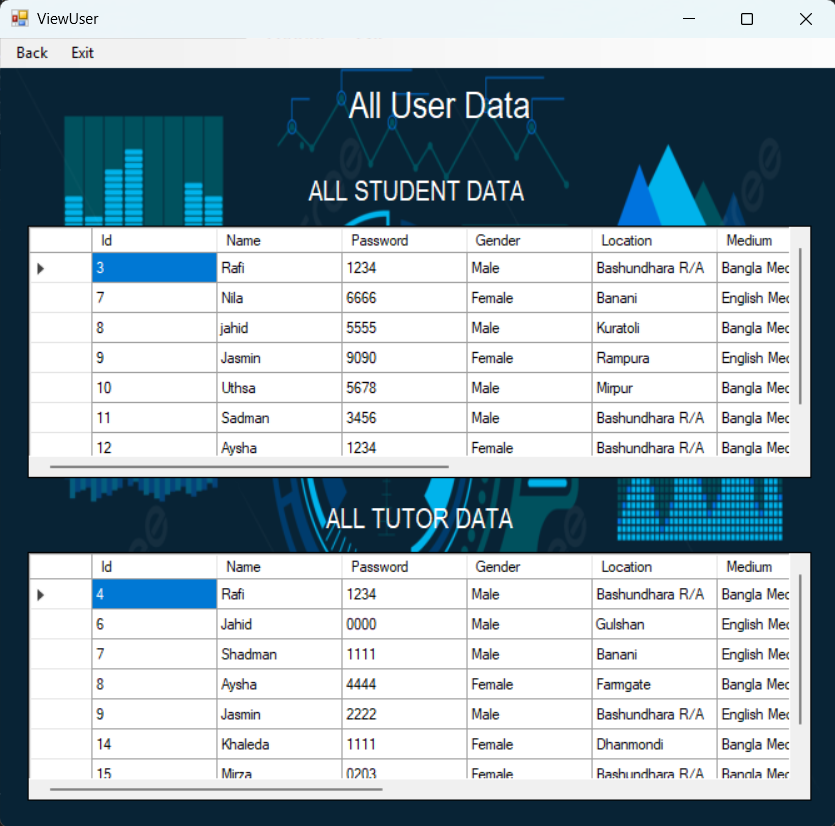
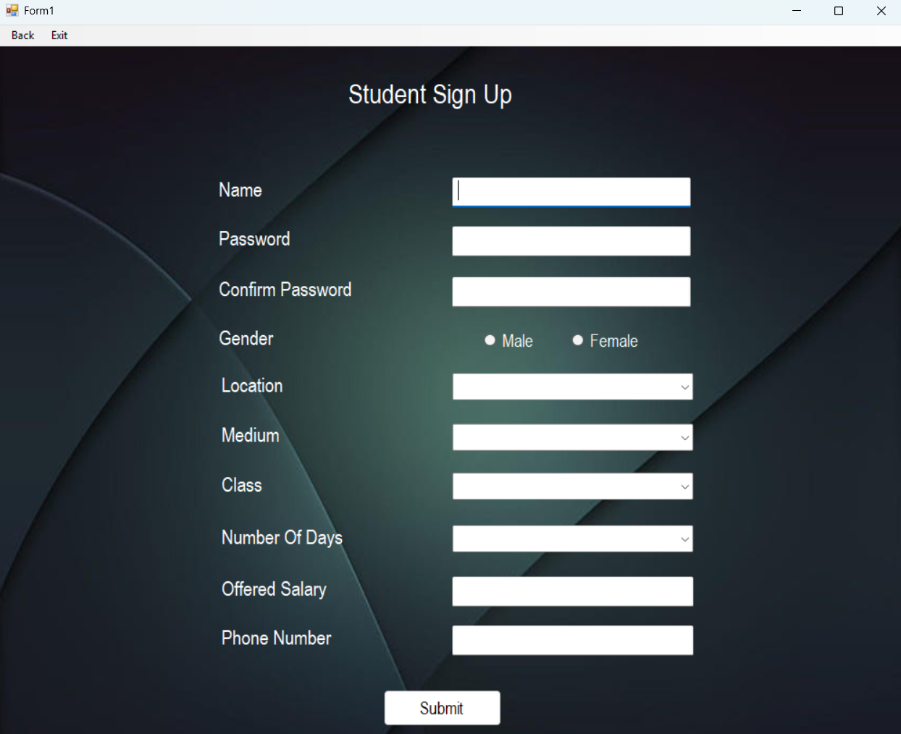

# Tuition Management System

## Overview
The Tuition Management System is a C# application designed to simplify tuition-related operations, including managing students, tutors.The software designed for working like a connection bridge for student and tutors

## Features
- Login with you credentials or Sign up for new account.
- After Login you will see all you Credentials and a Separate section where You Can see Request made by other user's for you.
- Search students or turors based on users requirement (e.g. Number of Days, University, Loation, Gender) and Request them if your Criterial mathches wiht them.
- Both student and tutors can accept or reject a proposal.
- Report any user with Selected case or Write or own issue the admin will take action.
- Admin control.
- CRUD Operation.

## Technologies
- Language: C#
- Database: MS SQL
- IDE: Visual Studio

## Getting Started
### Prerequisites
- Visual Studio
- Desktop Development (c#)
- Git

### Installation
1. Clone the repository:
   git clone https://github.com/FaisalAhmedRafi/TutionManageSystem.git
2. Open the solution in Visual Studio.
3. Configure the database connection string in appsettings.json.
4. Run database migrations (if applicable):
   dotnet ef database update
5. Start the application.

## Usage
- Login: Access the system using your credentials.
- Manage Records: Add, edit, or delete student and tutor details.
- Find your favourite student or tutor based on your criteria.

## Project Screenshots

### Login Page

### User Panel

### User Search

### Report User

### Admin Panel

### View All User

### User Sign Up (Tutor)

### User Sign Up (Student)

## Contact
- GitHub: FaisalAhmedRafi
- Email: faisalahmedrafi71@gmail.com

**Thank You**

